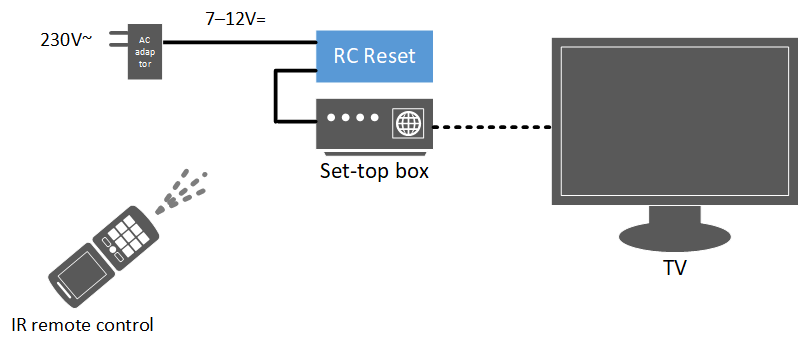
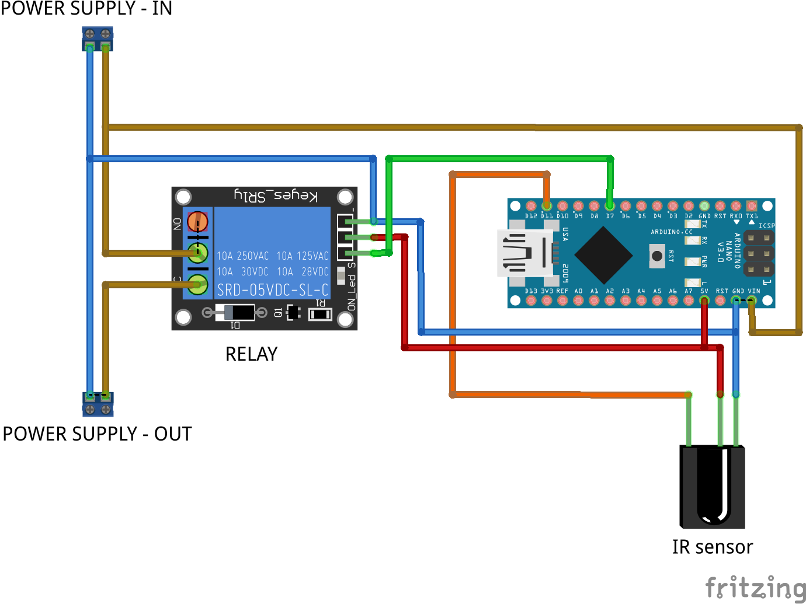
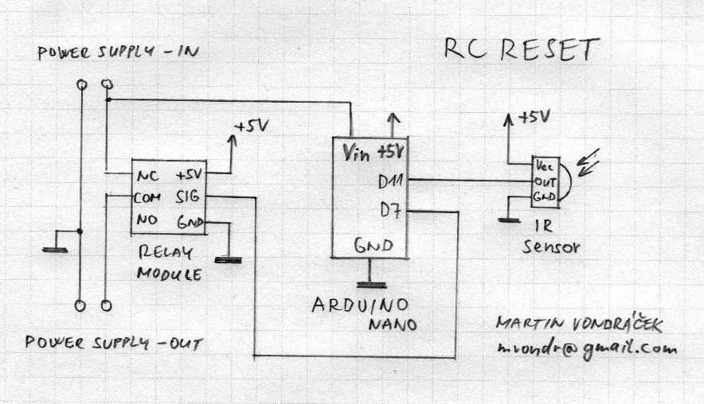

# RC Reset
Reset your set-top box using IR remote control and Arduino Nano!

> Hold down power off on your remote control for more than 2 seconds.  
> The Relay switches off and on the power supply.  

## Introduction

Sometimes, you need to reset your set-top box, but __if there is no reset button_ ... Yes, you need to unplug and plug in again the power connector physically.
And it may be a little bit annoying.

And what about to reset it **with the same IR remote control** which you use for your set-top box?

This Arduino project may solve the problem.

## Solution

This device, based on Arduino Nano, called "RC Reset" is inserted between set-top box and its connector for power suply as you can see on this figure:

  

## Functionality

By pressing the "power on / off" button on the remote control, the set-top box works as usual.

However, with long hold (more than 2 seconds), the RC Reset is activated and the set-top box power supply is interrupted for 5 seconds.

> Repeating disconnection is possible after a further 10 seconds.

_Picture: Press and hold "power on / off" button for more than 2 seconds_

## Construction

_Pictures above: Construction details_

## RC Reset boxed

_Pictures above: Boxed device_

## Breadboard schema

## Electrical schema

